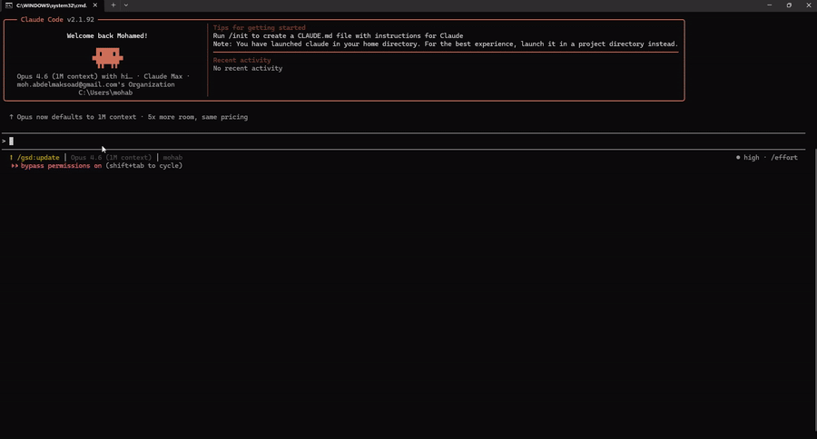

# Sekha

**Persistent memory for Claude Code. Zero dependencies. Plain markdown.
Plus: the only AI memory system that can hard-block destructive tool calls.**

## What Sekha does

**1. Remembers things across sessions.** Tell Claude in one session,
ask about it in the next, and it knows. Preferences, decisions, project
context, anything — saved as plain markdown files under `~/.sekha/`.
Close Claude Code. Open it again tomorrow. The memory is still there.

Claude invokes `sekha_save` / `sekha_search` / `sekha_list` / `sekha_delete`
via MCP to manage the memory itself. You just talk to Claude normally.

**2. Blocks dangerous tool calls (the moat).** Sekha hooks into Claude
Code's `PreToolUse` event and returns `permissionDecision: "deny"` when a
tool-input matches a regex rule you've written. The AI **cannot bypass this**,
even with `--dangerously-skip-permissions`. `rm -rf`, `git push --force`,
`DROP TABLE` — whatever you choose to guard. Rules are plain markdown in
`~/.sekha/rules/`, so your enforcement policy is as reviewable as any other
config under version control.

Every other memory system (MemPalace, Mem0, Letta, Zep, Basic Memory,
CLAUDE.md) only stores rules. Sekha enforces them at the hook boundary.

## Honest scope

**What Sekha enforces (hard):** regex-matchable tool-input patterns --
`rm -rf /`, `git push --force origin main`, `DROP TABLE users`. The
PreToolUse hook vetoes the tool call before it runs.

**What Sekha does NOT enforce:** behavioral rules like "always confirm before
acting" or "no assumptions." Those remain prompt-level reminders and the AI
can override them. See the [Threat Model](#threat-model) for why this is a
fundamental limit of today's Claude Code hook surface, not a bug in Sekha.



*Above: Sekha remembers what you told Claude in a previous session.
Rm-rf blocking demo coming soon.*

## Install

```bash
pip install sekha
sekha init
claude mcp add sekha -- sekha serve
```

`sekha init` wires the PreToolUse hook into `~/.claude/settings.json` and
creates `~/.sekha/` for memories and rules. `sekha doctor` will verify the
wiring whenever you want a sanity check.

## Features

- **Persistent memory across sessions.** Plain markdown files under
  `~/.sekha/` grouped into five fixed categories: `sessions`, `decisions`,
  `preferences`, `projects`, `rules`. Grep-friendly filenames, git-trackable
  if you want them in version control. Search with term-frequency x recency
  x filename-match scoring.
- **6 MCP tools** for the AI to manage memory itself: `sekha_save`,
  `sekha_search`, `sekha_list`, `sekha_delete`, `sekha_status`,
  `sekha_add_rule`.
- **Tool-pattern rule enforcement** at the hook level. For regex matches
  against tool inputs, the AI cannot bypass -- even with
  `--dangerously-skip-permissions`. Behavioral rules ("always confirm",
  "no assumptions") remain prompt-level and are overridable; see Threat Model.
- **Zero runtime dependencies** -- pure Python stdlib, no supply chain surface.
- **Works with any MCP client** for memory (Claude Code, Cursor, Cline,
  Windsurf). Hook-level rule enforcement is Claude Code exclusive in v0.1.0.
- **CLI**: `sekha init`, `sekha doctor`, `sekha add-rule`, `sekha list-rules`,
  `sekha hook run/bench/enable/disable`, `sekha serve`.

## How It Works

[Diagram: Claude Code -> PreToolUse hook -> sekha hook run -> rules engine -> block or allow]

Three processes, all sharing state under `~/.sekha/`:

1. **MCP server** (long-lived, one per Claude Code session) -- serves the
   memory tools.
2. **Hook** (short-lived, per tool call) -- reads the rules directory,
   matches `tool_name` + `pattern`, blocks or warns.
3. **CLI** (one-shot) -- `init`, `doctor`, `add-rule`, `list-rules`,
   `hook bench`, and friends.

The hook is the differentiator. Rules are loaded fresh on each invocation so
edits take effect immediately, and parse errors fail loudly to stderr rather
than silently skipping a rule.

## Example Rules

See [`examples/rules/`](examples/rules/) for copy-paste-ready rules:

- `block-rm-rf.md` -- prevent `rm -rf /`, `rm -rf ~`, `rm -rf *` disasters.
- `block-force-push-main.md` -- no `git push --force` against `main`/`master`.
- `block-drop-table.md` -- refuse `DROP TABLE` in Bash-invoked SQL.
- `warn-no-tests-before-commit.md` -- nudge before `git commit` without tests.

Each example is a single-purpose rule with inline commentary explaining how to
tighten or loosen the pattern.

## Threat Model

### What Sekha enforces

Regex patterns on tool inputs. If you write a rule that blocks the `Bash`
tool when its `command` field matches `rm -rf`, the AI cannot bypass it.
The PreToolUse hook runs as an out-of-process Python subprocess, evaluates
rules, and returns `permissionDecision: "deny"` for matches. Survives
`--dangerously-skip-permissions`.

### What Sekha does NOT enforce

Behavioral rules like "always confirm before editing," "don't guess," or
"explain your plan first." These live in memory/context as reminders. The AI
can and does ignore them. This is the class of rule for which no solution
exists today at the Claude Code layer -- prompt-level reminders (CLAUDE.md,
memory systems, warn-severity Sekha rules) all depend on voluntary
compliance.

There is no PreReason hook. Decisions happen in the AI's token stream between
tool calls, where no subprocess can intervene. Anyone claiming otherwise is
overselling.

### Why tool-pattern enforcement is still a *consistency* enforcer, not a *security* sandbox

Even within the things Sekha can block, the AI can work around a blocked
pattern by choosing a different tool. If you block `Bash` matching `rm -rf`,
the AI could `Write` a deletion script and invoke it via a tool you didn't
cover. Sekha scopes rules to `tool_name` deliberately so your policy stays
inspectable instead of hiding behind an opaque allowlist.

For containment against a compromised or adversarial AI, use OS-level
sandboxing -- container, VM, seccomp, etc. Sekha keeps the AI honest about
intentions you have made explicit. It does not protect you from a creative
agent actively working around your rules.

## Cross-Client Support

| Client       | Memory (MCP tools) | Rules Enforcement (hook) |
|--------------|--------------------|--------------------------|
| Claude Code  | Yes                | Yes                      |
| Cursor       | Yes                | No (no hook API)         |
| Cline        | Yes                | No                       |
| Windsurf     | Yes                | No                       |

Hook enforcement is **Claude Code exclusive** in v0.1.0. Memory tools work
everywhere MCP works.

## Docs

- [Integration test runbook](docs/hook-integration-test.md) -- verify the hook
  blocks on your machine, end to end.
- [CHANGELOG](CHANGELOG.md) -- version history.
- [Release runbook](docs/release.md) -- how maintainers cut a version.

## Contributing

See [CONTRIBUTING.md](CONTRIBUTING.md).

## License

MIT
